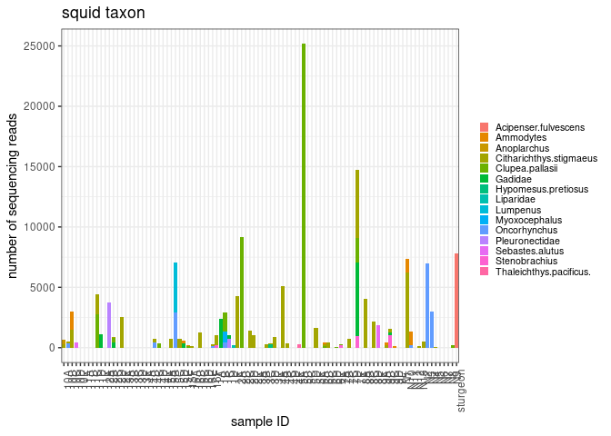
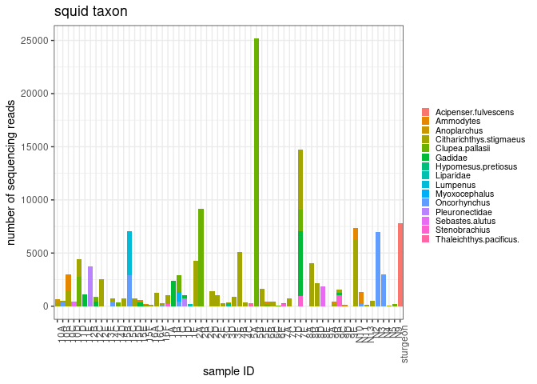
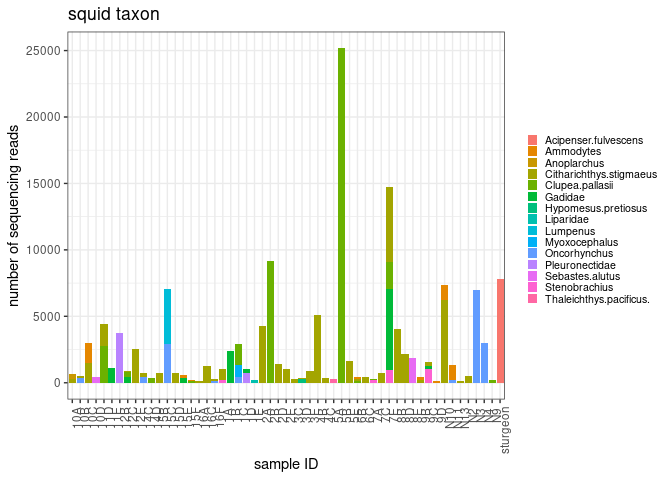
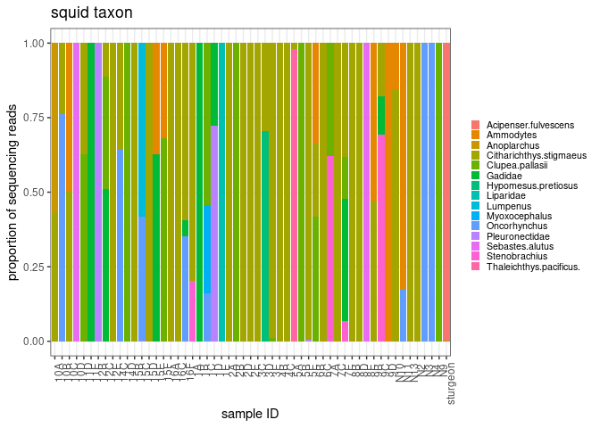
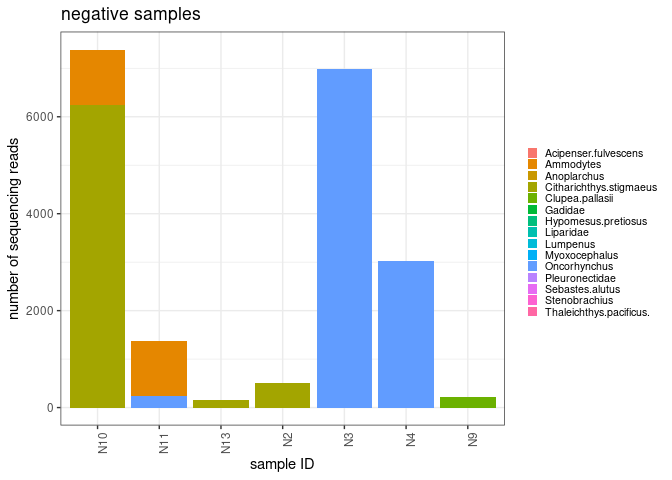
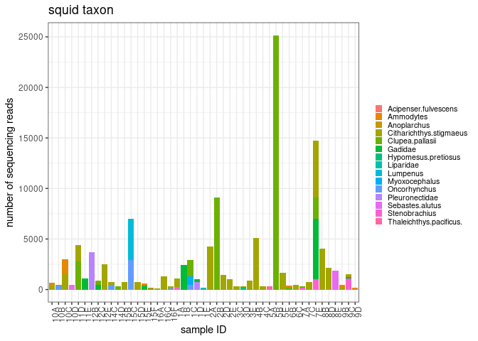
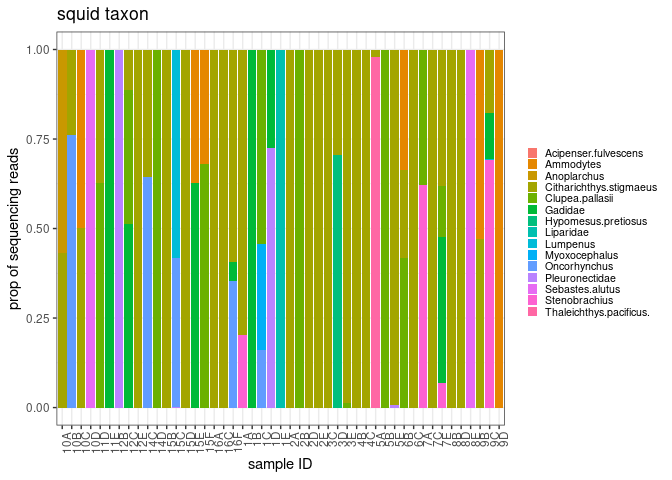

squid diet metabarcoding
================
Kimberly Ledger
2023-07-18

Taking a look at Charlotte’s squid diet samples.

Inputs: This code starts with the sample and taxon table that Charlotte
created by matching ASVs to taxons and condensing the table.

# Load libraries and data

load libraries

``` r
library(tidyverse)
```

    ## ── Attaching packages ─────────────────────────────────────── tidyverse 1.3.2 ──
    ## ✔ ggplot2 3.4.0     ✔ purrr   1.0.1
    ## ✔ tibble  3.2.1     ✔ dplyr   1.1.2
    ## ✔ tidyr   1.3.0     ✔ stringr 1.5.0
    ## ✔ readr   2.1.3     ✔ forcats 0.5.2
    ## ── Conflicts ────────────────────────────────────────── tidyverse_conflicts() ──
    ## ✖ dplyr::filter() masks stats::filter()
    ## ✖ dplyr::lag()    masks stats::lag()

``` r
#library(dplyr)
library(ggplot2)
```

load sample/taxon table

``` r
results_table <- read.csv("results_filtered_and_condensed_CS.csv")
```

reformat data table

``` r
results_long <- results_table %>%
  pivot_longer(cols = c(2:16), names_to = "taxon", values_to = "reads")
head(results_long)
```

    ## # A tibble: 6 × 3
    ##   Sample_ID taxon                   reads
    ##   <chr>     <chr>                   <int>
    ## 1 10A       Citharichthys.stigmaeus   290
    ## 2 10A       Clupea.pallasii             0
    ## 3 10A       Oncorhynchus                0
    ## 4 10A       Acipenser.fulvescens        0
    ## 5 10A       Ammodytes                   0
    ## 6 10A       Lumpenus                    0

plot everything

``` r
ggplot(results_long, aes(x=Sample_ID, y=reads, fill=taxon)) +
  geom_bar(stat = "identity") + 
    theme_bw() +
  labs(
    y = "number of sequencing reads",
    x = "sample ID",
    title = "squid taxon") + 
  theme(
    axis.text.x = element_text(angle = 90, hjust = 0.95),
    legend.text = element_text(size = 8),
    legend.key.size = unit(0.3, "cm"),
    legend.position = "right",
    legend.title = element_blank()
  )
```

<!-- -->

calculate read total and proportions per sample

``` r
results_long <- results_long %>%
  group_by(Sample_ID) %>%
  mutate(total = sum(reads)) %>%
  mutate(prop = reads/total)
```

remove samples with no reads from plot

``` r
results_long %>%
  filter(total != 0) %>%
  ggplot(aes(x=Sample_ID, y=reads, fill=taxon)) +
  geom_bar(stat = "identity") + 
    theme_bw() +
  labs(
    y = "number of sequencing reads",
    x = "sample ID",
    title = "squid taxon") + 
  theme(
    axis.text.x = element_text(angle = 90, hjust = 0.95),
    legend.text = element_text(size = 8),
    legend.key.size = unit(0.3, "cm"),
    legend.position = "right",
    legend.title = element_blank()
  )
```

<!-- -->

remove samples with less than 100 reads

``` r
results_long %>%
  filter(total > 100) %>%
  ggplot(aes(x=Sample_ID, y=reads, fill=taxon)) +
  geom_bar(stat = "identity") + 
    theme_bw() +
  labs(
    y = "number of sequencing reads",
    x = "sample ID",
    title = "squid taxon") + 
  theme(
    axis.text.x = element_text(angle = 90, hjust = 0.95),
    legend.text = element_text(size = 8),
    legend.key.size = unit(0.3, "cm"),
    legend.position = "right",
    legend.title = element_blank()
  )
```

<!-- -->

``` r
results_long %>%
  filter(total > 100) %>%
  ggplot(aes(x=Sample_ID, y=prop, fill=taxon)) +
  geom_bar(stat = "identity") + 
    theme_bw() +
  labs(
    y = "proportion of sequencing reads",
    x = "sample ID",
    title = "squid taxon") + 
  theme(
    axis.text.x = element_text(angle = 90, hjust = 0.95),
    legend.text = element_text(size = 8),
    legend.key.size = unit(0.3, "cm"),
    legend.position = "right",
    legend.title = element_blank()
  )
```

<!-- -->

``` r
results_long %>%
  filter(total > 100) %>%
  filter(str_starts(Sample_ID, "N")) %>%
  ggplot(aes(x=Sample_ID, y=reads, fill=taxon)) +
  geom_bar(stat = "identity") + 
    theme_bw() +
  labs(
    y = "number of sequencing reads",
    x = "sample ID",
    title = "negative samples") + 
  theme(
    axis.text.x = element_text(angle = 90, hjust = 0.95),
    legend.text = element_text(size = 8),
    legend.key.size = unit(0.3, "cm"),
    legend.position = "right",
    legend.title = element_blank()
  )
```

<!-- -->

``` r
results_long %>%
  filter(total > 100) %>%
  filter(!str_starts(Sample_ID, "N")) %>%
  filter(Sample_ID != "sturgeon") %>%
  ggplot(aes(x=Sample_ID, y=reads, fill=taxon)) +
  geom_bar(stat = "identity") + 
    theme_bw() +
  labs(
    y = "number of sequencing reads",
    x = "sample ID",
    title = "squid taxon") + 
  theme(
    axis.text.x = element_text(angle = 90, hjust = 0.95),
    legend.text = element_text(size = 8),
    legend.key.size = unit(0.3, "cm"),
    legend.position = "right",
    legend.title = element_blank()
  )
```

<!-- -->

``` r
results_long %>%
  filter(total > 100) %>%
  filter(!str_starts(Sample_ID, "N")) %>%
  filter(Sample_ID != "sturgeon") %>%
  ggplot(aes(x=Sample_ID, y=prop, fill=taxon)) +
  geom_bar(stat = "identity") + 
    theme_bw() +
  labs(
    y = "prop of sequencing reads",
    x = "sample ID",
    title = "squid taxon") + 
  theme(
    axis.text.x = element_text(angle = 90, hjust = 0.95),
    legend.text = element_text(size = 8),
    legend.key.size = unit(0.3, "cm"),
    legend.position = "right",
    legend.title = element_blank()
  )
```

<!-- -->

``` r
results_long %>%
  filter(total > 100) %>%
  filter(!str_starts(Sample_ID, "N")) %>%
  filter(Sample_ID != "sturgeon") %>% 
  filter(reads > 0) %>%
  group_by(taxon) %>%
  summarise(n_squid = n(),
            total_reads = sum(reads)) %>% #  ,
            #mean_prop = mean(prop)) %>%
  arrange(desc(total_reads))
```

    ## # A tibble: 14 × 3
    ##    taxon                   n_squid total_reads
    ##    <chr>                     <int>       <int>
    ##  1 Clupea.pallasii              11       41832
    ##  2 Citharichthys.stigmaeus      31       39021
    ##  3 Gadidae                       8       10865
    ##  4 Pleuronectidae                4        4496
    ##  5 Oncorhynchus                  5        4327
    ##  6 Lumpenus                      3        4097
    ##  7 Stenobrachius                 4        2461
    ##  8 Sebastes.alutus               2        2340
    ##  9 Ammodytes                     6        2295
    ## 10 Myoxocephalus                 1         865
    ## 11 Anoplarchus                   1         381
    ## 12 Thaleichthys.pacificus.       1         292
    ## 13 Hypomesus.pretiosus           1         249
    ## 14 Liparidae                     1         174
